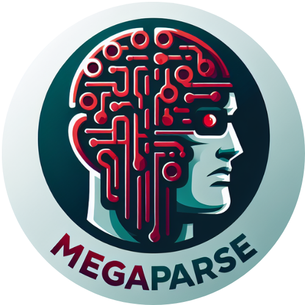

# MegaParse - Your Mega Parser for every type of documents

    

MegaParse is a powerful and versatile parser that can handle various types of documents with ease. Whether you're dealing with text, PDFs, Powerpoint presentations, Word documents MegaParse has got you covered. Focus on having no information loss during parsing.

## Key Features 🎯
- **Versatile Parser**: MegaParse is a powerful and versatile parser that can handle various types of documents with ease.
- **No Information Loss**: Focus on having no information loss during parsing.
- **Fast and Efficient**: Designed with speed and efficiency at its core.
- **Wide File Compatibility**: Supports Text, PDF, Powerpoint presentations, Excel, CSV, Word documents.
- **Open Source**: Freedom is beautiful, and so is MegaParse. Open source and free to use.
